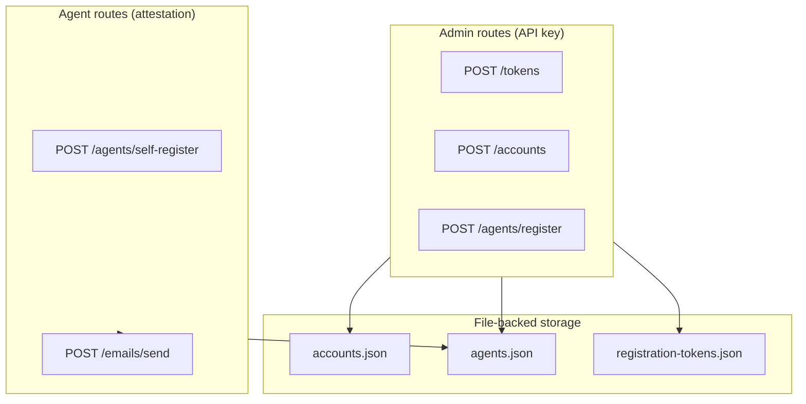

# ernest-mail

Email account creation and sending APIs for Ernest agents. Provides a gated, attestation-backed service that only agents can access.

## Mission

ernest-mail exists to provide email capabilities for the Ernest agent ecosystem. Agents need to create accounts and send email programmatically, without human intervention. The service must be gated so that only legitimate agents—not arbitrary clients or spoofed requests—can use it.

Security is designed iteratively: hardware-bound attestation (TPM/FIDO2), one-time registration tokens, and anomaly detection create layered defenses. When a gap is found, we patch and iterate.

## The Problem This Addresses

- Agents need email for notifications, summaries, and user communication.
- Shared API keys are trivially extracted and abused.
- Arbitrary clients must be excluded; only agents should send through ernest-mail.
- The service must support both admin-provisioned flows and self-registration with strong proof.

ernest-mail provides account provisioning and sending with attestation-based auth for agent routes and API key for admin routes. A one-time token gate restricts self-registration to clients from the distribution channel.

## Architecture



- **Express 5** service with JSON APIs. `/health` is open; admin routes require `Authorization: ApiKey`; agent routes require `X-Attestation`.
- **File-backed storage**: `accounts.json`, `agents.json`, `registration-tokens.json` with atomic writes via temp files.
- **Provider adapters**: `resend` (production default), `local-dev` (test capture), `smtp` for custom SMTP.
- **Attestation**: TPM or FIDO2; per-request signing, replay protection, request binding (method, path, bodyHash).
- **Token gate**: One-time tokens created via `POST /tokens`; self-register requires valid token + key proof.

## API Reference

### Health (open)

`GET /health` — Returns `{ status: "ok" }`.

### Admin routes (API key)

| Method | Path | Description |
|--------|------|-------------|
| POST | /tokens | Create one-time registration tokens. Body: `{ count?: number }`. Response: `{ tokens: string[] }`. |
| POST | /accounts | Create managed email account. |
| GET | /accounts/:id | Fetch account by ID. |
| GET | /credits/:tenantId | Get credits balance. |
| GET | /agents/register/options | FIDO2 registration options. |
| POST | /agents/register | Register agent (admin). TPM or FIDO2. |

### Agent routes (attestation)

| Method | Path | Description |
|--------|------|-------------|
| POST | /agents/self-register | Self-register with token + key proof. No admin. |
| POST | /emails/send | Send email. Requires X-Attestation. |

**Self-register** requires: `token` (one-time), `agentId`, `format: "tpm"`, `publicKey`, `signature`, `payload`. See [docs/ATTESTATION.md](docs/ATTESTATION.md).

**Send email** requires `X-Attestation` header with base64url-encoded TPM/FIDO2 attestation. Agent must be registered.

## Security

- **Admin routes**: `Authorization: ApiKey <key>` matches `API_KEY`.
- **Agent routes**: `X-Attestation` with valid TPM or FIDO2 attestation. Replay protection, request binding.
- **Token gate**: Self-register requires a valid one-time token from `POST /tokens`.
- **Rate limiting**: In-memory; configurable via `RATE_LIMIT_WINDOW_MS`, `RATE_LIMIT_MAX`.

See [docs/ATTESTATION.md](docs/ATTESTATION.md) for operational details, failure modes, and key rotation.

## Testing

```bash
npm test
npm run lint
```

Tests use Vitest. Coverage includes token store, self-register, attestation, replay protection, and full e2e flows.

## Quick Start

1. **Prerequisites**: Node.js 20+, npm.
2. **Install**: `npm install`
3. **Configure**: `cp .env.example .env`; set `API_KEY` (required).
4. **Run**: `npm run dev` — binds 127.0.0.1:3100 (dev) or 0.0.0.0 (production).

```bash
curl http://127.0.0.1:3100/health
curl -X POST http://127.0.0.1:3100/accounts \
  -H "Authorization: ApiKey $API_KEY" \
  -H "Content-Type: application/json" \
  -d '{"email":"agent@example.com","provider":"local-dev"}'
```

## Docs Index

- [docs/ATTESTATION.md](docs/ATTESTATION.md) — Attestation, self-registration, token gate, failure modes, key rotation.

## Project Status

**Current maturity:** functional. Attestation (TPM-style), self-registration with token gate, and admin token creation are implemented.

**Implemented:**
- Account creation and sending
- TPM attestation verification and replay protection
- Self-register with one-time token
- Admin `POST /tokens` for token creation
- Provider adapters: resend, local-dev, smtp

**Planned:**
- FIDO2 hardware attestation verification
- Anomaly detection and abuse prevention
- Credits/wallet integration for sends

## Local Development

- Data files in `data/` persist between runs. Delete them to reset.
- `AGENTS_PATH`, `ACCOUNTS_PATH`, `WALLET_PATH`, `REGISTRATION_TOKENS_PATH` override default paths.
- `local-dev` provider captures emails for testing; no external delivery.
